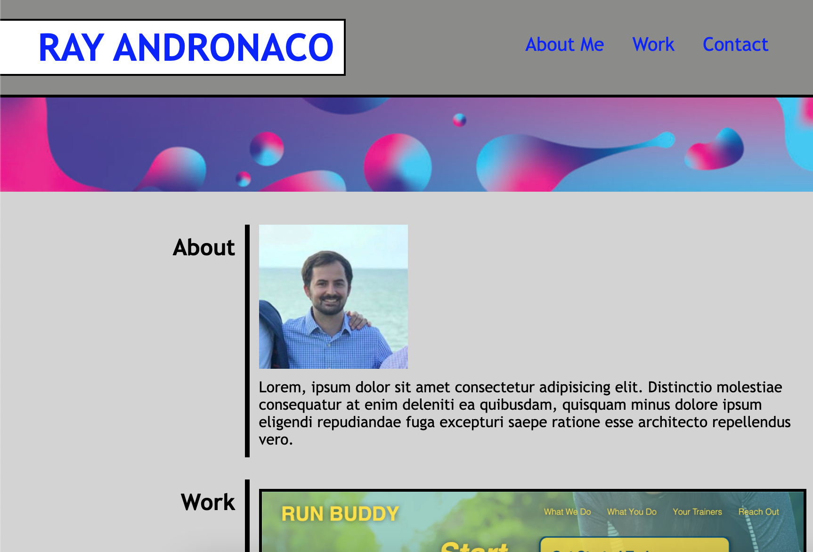

# portfolio-assignment

## Employer Ask

"AS AN employer
I WANT to view a potential employee's deployed portfolio of work samples
SO THAT I can review samples of their work and assess whether they're a good candidate for an open position"

## What Was Done
The portfolio was made from scratch
The portfolio features:
    A header with an interactive navigation
    An "About" section with an avatar and placeholder text
    A "Work" section featuring:
        Images of previous work (the same project was used for all images as a placeholder)
        The images use a hover pseudocode
        The images are clickable and lead to the deployed application
    A "Contact" section with interactive links
    CSS styling to ensure a clean design
    Media query to reformat page at 768px width

## Preview of the Portfolio

## Preview of the Portfolio with Media Query
